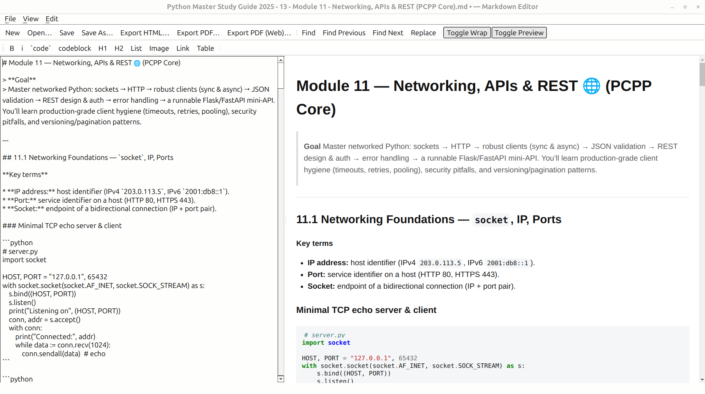
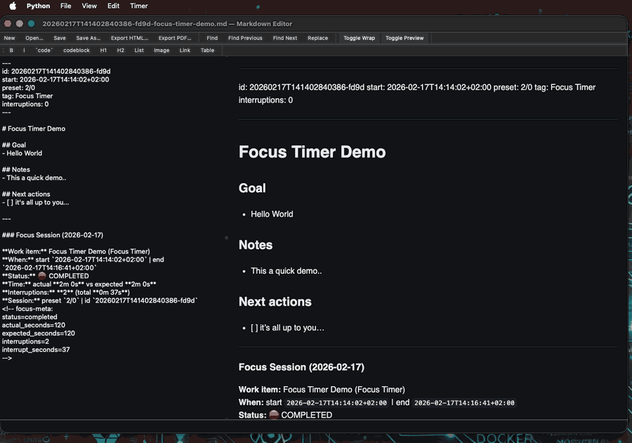

# PyMarkdownEditor

A fast, minimal **PyQt6** Markdown editor with live preview, HTML/PDF export, and a clean, SOLID-friendly architecture.  
This editor supports Focus Sessions: timed work blocks that auto-append structured Markdown timesheets into your notes.
Owner-led governance; contributions welcome (see [CONTRIBUTING](CONTRIBUTING.md)).

[](https://github.com/clintonshane84/PyMarkdownEditor/actions/workflows/ci.yml)
[](https://github.com/clintonshane84/PyMarkdownEditor/actions/workflows/release-binaries.yml)



---

## Features

- **Live preview**  
  Debounced, side-by-side Markdown preview while you type.

- **Markdown rendering**  
  Uses `python-markdown` with common extensions:
  `extra`, `fenced_code`, `codehilite`, `toc`, `sane_lists`, `smarty`, and supports extra extensions such as `pymdown-extensions` (e.g. math/LaTeX via `arithmatex`).

- **Dark-mode aware CSS**  
  Preview uses theme-friendly styles that work in both light and dark environments.

- **Robust file handling**
  - Open/Save `.md` with **atomic** writes (`QSaveFile`, UTF-8).
  - **Recent files** persisted via `QSettings`.
  - **Drag & drop** files onto the window to open them.

- **Exporters**
  - **HTML** – saves the preview HTML as-is.
  - **PDF (classic)** – QTextDocument/QPrinter (A4, 12.7 mm margins) to mirror the preview.
  - **PDF (WebEngine)** – optional QWebEngine-based exporter (`web_pdf_exporter.py`) for closer “what you see is what you print” output when Qt WebEngine is available.

- **Editor helpers**
  - One-click **bold**, *italic*, `` `inline code` ``.
  - Heading helpers: `# H1`, `## H2`.
  - List helper: `- list`.
  - **Insert link** dialog.
  - **Insert image** dialog.
  - **Insert table** dialog.
  - **Find / Replace / Replace all** dialog.
  - Toggle **wrap** and **preview** from toolbar/menu.

- **Pomodoro focus timer + session notes**
  - `Timer` menu with: **Start Focus Session…**, **Pause / Resume**, **Stop & Save**, **Timer Settings…**.
  - Start flow collects title, tag, preset (`25/5`, `50/10`, or custom), and target folder.
  - Start on a **new note** or continue on the **current note**.
  - Detached floating timer window (always-on-top) with countdown + Pause/Stop controls.
  - Timer color states: green (normal), amber (warning), red (final stretch).
  - Auto-save active session note every N minutes (default `2`), and on pause/stop/app close.
  - Session summary updates in-place (pure Markdown) with a consultant-friendly format:
    1) what you worked on, 2) when, 3) actual vs expected duration, 4) interruption count, 5) interruption time cost.
  - Includes hidden machine-friendly metadata (`focus-meta`) for future exports/charts/reporting.
  - Alarm options: built-in profiles (`Beep`, `Chime`, `Bell`, `Ping`) or custom sound file with preview.
  - Timer settings persist locally on disk (no reconfiguration each launch).
  - Appends local JSONL session logs to `~/.focusforge/logs/YYYY-MM-DD.jsonl`.

  _Quick demo: starting a focus session, live timer, and auto-generated Markdown summary._

  

- **Architecture**
  - SOLID-leaning design with clear boundaries.
  - Simple dependency injection container.
  - Strategy-based exporters registered in an `ExporterRegistry` singleton.
  - Thin Qt UI (`MainWindow` + dialogs) that delegates to services.

---

## Installation

### From source (current)

```bash
# 1) Create and activate a virtual environment
python -m venv .venv

# Windows
. .venv/Scripts/activate

# macOS / Linux
source .venv/bin/activate

# 2) Install runtime dependencies
pip install -r requirements.txt

# 3) Run the app
python -m pymd
````

> **Python:** 3.10+ recommended.

### From PyPI (planned / when published)

Once the package is live on PyPI under `py-markdown-editor`, installation will look like:

```bash
pip install py-markdown-editor
python -m pymd
```

If you later add a console script entry point, this could become as simple as:

```bash
pymd
```

---

## Requirements

Runtime dependencies (see `requirements.txt` for exact versions):

```txt
PyQt6>=6.6
Markdown>=3.5
Pygments>=2.17
pymdown-extensions
```

> For WebEngine-based PDF export, you may also need:
>
> ```txt
> PyQt6-WebEngine
> ```
>
> and the corresponding Qt WebEngine system libraries on your platform.

Dev/test tools live in `dev-requirements.txt`—see **Testing**.

---

## Keyboard Shortcuts & UI

**Core actions**

* **New / Open / Save / Save As** – standard platform shortcuts.
* **Toggle wrap** – toolbar/menu.
* **Toggle preview** – toolbar/menu.
* **Quit** – standard platform shortcut.

**Text & formatting**

* Toolbar/menu helpers:

  * `**B**` – bold.
  * `*i*` – italic.
  * `` `code` `` – inline code.
  * `# H1`, `## H2` – heading prefixes.
  * `- list` – bullet list prefix.

**Insert / dialogs**

* **Insert link…** – opens the link dialog.
* **Insert image…** – opens a file chooser and inserts an image reference.
* **Insert table…** – opens the table dialog to generate Markdown tables.
* **Start Focus Session…** – opens the pomodoro/session setup dialog.
* **Timer Settings…** – configure auto-save interval, sound enablement, alarm profile/custom sound with preview, and default session folder.
* **About…** – opens the About dialog.

**Find & replace**

* **Find…** – open the find dialog.
* **Replace…** – open find/replace dialog.
* **Replace all** – replace all matches in the document.

**Timer**

* **Pause / Resume** – pauses or resumes the active focus session.
* **Stop & Save** – stops the active session and writes a session log entry.
* **Floating Timer Window** – detached always-on-top countdown with Pause/Stop buttons.
* **Active Session Lock** – while a session is active, opening/switching to other notes is blocked to keep session capture consistent.

(Exact keyboard accelerators may vary slightly by platform/Qt style, but all are exposed via menus and toolbars.)

---

## Why This Helps

- **Consultant-ready time capture**  
  Turn regular Markdown notes into lightweight session evidence you can use for reporting and billing support.

- **Lower context-switch overhead**  
  Timer and notes live in one tool, so there is no need to bounce between editor + timer + tracker apps.

- **Interruption visibility**  
  You capture not just total work time, but also interruption count and interruption duration.

- **Local-first and private**  
  Data stays on your machine: notes in your folders, logs in `~/.focusforge/logs/`, settings in local app config.

---

## Project Structure

High-level repo layout:

```txt
.
├── build-requirements.txt
├── CHANGELOG.md
├── config/
├── CONTRIBUTING.md
├── dev-requirements.txt
├── dist/
├── docs/
│   ├── CI.md
│   ├── RELEASING.md
│   ├── focus-timer-preview.gif
│   └── screenshot.png
├── LICENSE
├── pyinstaller.spec
├── PyMarkdownEditor.spec
├── pyproject.toml
├── README.md
├── requirements.txt
├── ruff.toml
├── tests/
│   ├── conftest.py
│   ├── test_about_dialog.py
│   ├── test_container.py
│   ├── test_exporter_registry.py
│   ├── test_file_service.py
│   ├── test_focus_dialogs.py
│   ├── test_focus_services.py
│   ├── test_html_exporter.py
│   ├── test_ini_config_service.py
│   ├── test_main_window.py
│   ├── test_markdown_renderer.py
│   ├── test_models.py
│   ├── test_pdf_exporter.py
│   ├── test_settings_service.py
│   └── test_table_dialog.py
└── pymd/
    ├── __init__.py
    ├── __main__.py        # python -m pymd entry point
    ├── main.py            # legacy/alt entry point
    ├── app.py             # QApplication bootstrap + DI container wiring
    ├── di/
    │   ├── __init__.py
    │   └── container.py
    ├── domain/
    │   ├── __init__.py
    │   ├── interfaces.py
    │   └── models.py
    ├── services/
    │   ├── __init__.py
    │   ├── config/
    │   │   └── ini_config_service.py
    │   ├── exporters/
    │   │   ├── __init__.py
    │   │   ├── base.py
    │   │   ├── html_exporter.py
    │   │   ├── pdf_exporter.py
    │   │   └── web_pdf_exporter.py
    │   ├── focus/
    │   │   ├── __init__.py
    │   │   ├── focus_session_service.py
    │   │   ├── session_writer.py
    │   │   └── timer_settings.py
    │   ├── file_service.py
    │   ├── markdown_renderer.py
    │   ├── settings_service.py
    │   └── ui/
    │       ├── __init__.py
    │       ├── about.py
    │       ├── create_link.py
    │       ├── floating_timer_window.py
    │       ├── find_replace.py
    │       ├── focus_dialogs.py
    │       ├── main_window.py
    │       ├── table_dialog.py
    │       ├── adapters/
    │       │   ├── __init__.py
    │       │   ├── qt_dialogs.py
    │       │   ├── qt_messages.py
    │       │   └── qt_text_editor.py
    │       ├── commands/
    │       │   ├── __init__.py
    │       │   ├── prefix_lines.py
    │       │   └── surround_selection.py
    │       ├── ports/
    │       │   ├── __init__.py
    │       │   ├── dialogs.py
    │       │   └── messages.py
    │       └── presenters/
    │           ├── __init__.py
    │           └── main_presenter.py
    └── utils/
        ├── __init__.py
        └── constants.py
```

**Key pieces:**

* **`pymd/app.py`**
  Application bootstrap – sets up Qt app, DI container, and main window.

* **`pymd/di/container.py`**
  Wires services, exporters, and UI into a single container.

* **`pymd/domain/`**
  Core interfaces and models (keeps contracts decoupled from Qt/UI details).

* **`pymd/services/`**

  * `markdown_renderer.py` – wraps Markdown + extensions.
  * `file_service.py` – safe file IO with atomic writes.
  * `settings_service.py` / `config/ini_config_service.py` – settings and INI-based config.
  * `focus/` – focus session service, note template writer, and timer settings persistence.
  * `exporters/` – HTML/PDF/Web PDF exporters behind a common base.

* **`pymd/services/ui/`**

  * `main_window.py` – main editor window.
  * `focus_dialogs.py`, `floating_timer_window.py` – pomodoro/session UI.
  * `about.py` – About dialog.
  * `create_link.py`, `find_replace.py`, `table_dialog.py` – feature dialogs.
  * `adapters/` – Qt-specific implementations of dialog, message, and text editor ports.
  * `ports/` – abstraction interfaces for dialogs/messages (for testability and decoupling).
  * `presenters/` – presenter layer (e.g. `main_presenter.py`) coordinating UI + services.
  * `commands/` – small text-editing “command” helpers (e.g. prefix lines, surround selection).

* **`pymd/utils/`**
  Small shared constants and helpers.

* **`tests/`**
  Coverage for container wiring, dialogs, exporters, config service, and core services.

---

## Testing

Install dev dependencies:

```bash
pip install -r dev-requirements.txt
```

Then run the test suite:

```bash
pytest --cov=pymd --cov-report=term-missing --timeout=120
```

`dev-requirements.txt` includes (excerpt):

```txt
pytest>=8.0
pytest-qt>=4.4
pytest-cov>=5.0
pytest-timeout
ruff
```

Notes:

* Qt tests are written to avoid blocking modal dialogs.
* Coverage includes both happy paths and error handling (e.g. file write failures, malformed config).
* A fast “quick CI” config exists for non-`master` branches, and a fuller matrix runs for PRs to `master`.

---

## Building Binaries (PyInstaller)

You can bundle PyMarkdownEditor into standalone binaries using **PyInstaller**.

A minimal local example:

```bash
pip install pyinstaller

pyinstaller -n PyMarkdownEditor --windowed --onefile \
  -i NONE -s -y pymd/__main__.py
```

The repository’s GitHub Actions workflow `.github/workflows/release-binaries.yml`:

* Builds on **Windows**, **Linux**, and **macOS**.
* Uses a `.spec` file on Windows for predictable layout.
* Uses platform-appropriate commands on Linux/macOS (e.g. `.app` bundle on macOS).
* Collects hidden imports for:

  * `markdown`
  * `pygments`
  * `PyQt6` modules
  * `pymdownx` (e.g. `arithmatex`).

Artifacts are zipped or packaged per platform and attached to GitHub Releases for tagged versions (e.g. `v0.8.2`).

---

## CI, Releases & Publishing

* **Continuous Integration** – `.github/workflows/ci.yml`

  * Runs on pushes/PRs.
  * Performs `ruff` formatting checks and `pytest` with coverage.
  * Uses a quick single-job run for development branches and a full OS/Python matrix for PRs to `master`.

* **Binary Releases** – `.github/workflows/release-binaries.yml`

  * Triggered by pushing a semver tag: `vMAJOR.MINOR.PATCH` (e.g. `v0.8.2`).
  * Builds cross-platform binaries and uploads artifacts to the GitHub Release.

* **PyPI / TestPyPI Publishing** – `.github/workflows/publish.yml`

  * Triggered on tags like `v0.8.0`, `v0.8.1a1`, `v0.8.1-foo`.
  * Verifies that the tag (e.g. `v0.8.2`) matches `project.version` in `pyproject.toml`.
  * Builds sdist + wheel using `python -m build`.
  * Uses **Trusted Publishing**:

    * Pre-release or hyphenated tags → **TestPyPI**.
    * Final releases → **PyPI**.

See [CHANGELOG.md](CHANGELOG.md) for a detailed history of changes.

---

## Troubleshooting

* **PDF export blank/empty**

  * Ensure the target folder exists and is writable.
  * Check that any required Qt print/WebEngine libraries are installed.

* **Fonts differ between preview and PDF**

  * QPrinter rasterization and platform fonts may differ.
  * Consider tweaking the CSS or installing appropriate fonts system-wide.

* **Qt / WebEngine errors**

  * If using the WebEngine PDF exporter, make sure `PyQt6-WebEngine` and matching Qt WebEngine libraries are available.
  * You can fall back to the classic QTextDocument/QPrinter exporter if needed.

* **`ModuleNotFoundError: 'pymdownx'`**

  * Install `pymdown-extensions`:

    ```bash
    pip install pymdown-extensions
    ```
  * Ensure it is present in your environment or packaged with your binary.

---

## Contributing

We welcome issues and pull requests.

* [CONTRIBUTING.md](CONTRIBUTING.md) – owner-led governance, DCO sign-off, PR checklist.
* [LICENSE](LICENSE) – Apache-2.0.
* `.github/CODEOWNERS` (if present) – lists current code owners.

“Owner-led governance” means:

* The maintainer steers overall scope and architecture.
* The app aims to stay **small, focused, and easy to package**.
* PRs are reviewed for fit, clarity, and maintainability before merging.

**Quick dev loop:**

```bash
# format / lint
pip install ruff black
ruff format .
ruff check .

# run tests
pytest --cov=pymd --cov-report=term-missing --timeout=120
```

You can wire these into pre-commit hooks for a smoother local workflow.

---

## License

Apache-2.0 © 2025 **clintonshane84**
See [LICENSE](LICENSE).
