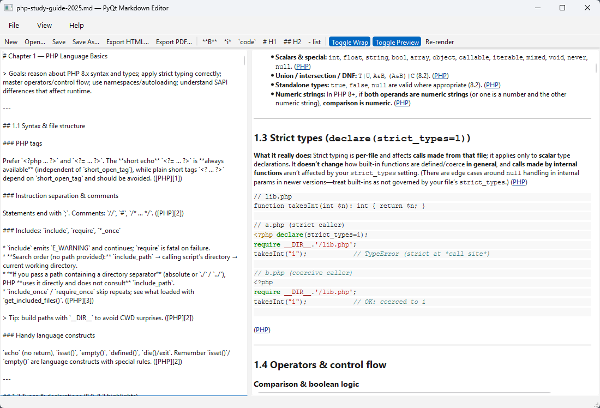

# PyMarkdownEditor

A fast, minimal **PyQt6** Markdown editor with live preview, HTML/PDF export, and a clean, SOLID-friendly architecture.  
Owner-led governance; contributions welcome (see [CONTRIBUTIONS](CONTRIBUTING.md)).



---

## Features

- **Live preview** (debounced) side-by-side with the editor
- **Markdown rendering** via `python-markdown` (+ `extra`, `fenced_code`, `codehilite`, `toc`, `sane_lists`, `smarty`)
- **Dark-mode aware CSS** for preview
- **Open/Save** `.md` with **atomic** writes (`QSaveFile`, UTF-8)
- **Recent files** (persisted with `QSettings`)
- **Drag & drop** to open files
- **Exporters**
  - **HTML** – saves preview HTML as-is
  - **PDF** – QPrinter (A4, 12.7 mm margins) to mirror preview
- **Editor helpers**: bold/italic/inline code, H1/H2/list, wrap toggle, preview toggle
- **Architecture**: SOLID, dependency injection, strategy-based exporters

---

## Quick Start

```bash
# 1) Create and activate a venv
python -m venv .venv
# Windows
. .venv/Scripts/activate
# macOS/Linux
source .venv/bin/activate

# 2) Install runtime deps
pip install -r requirements.txt

# 3) Run
python -m pymd
# or
python pymd/main.py
````

> **Python:** 3.10+ recommended

---

## Requirements

`requirements.txt`

```
PyQt6>=6.6
Markdown>=3.5
Pygments>=2.17
```

(Dev/test tools live in `dev-requirements.txt`—see **Testing** below.)

---

## Keyboard Shortcuts

* **New/Open/Save/Save As**: standard platform shortcuts
* **Re-render**: `Ctrl+R`
* **Toggle Wrap**: toolbar/menu
* **Toggle Preview**: toolbar/menu
* Formatting helpers from toolbar:

  * `**B**`, `*i*`, `` `code` ``, `# H1`, `## H2`, `- list`

---

## Project Structure

```
pymd/
  __init__.py
  __main__.py
  main.py
  app.py
  di/
    container.py
  domain/
    interfaces.py
    models.py
  services/
    markdown_renderer.py
    file_service.py
    settings_service.py
    exporters/
      base.py
      html_exporter.py
      pdf_exporter.py
  ui/
    main_window.py
  utils/
    constants.py
```

* **DI**: `di/container.py` wires services + registers exporters
* **Interfaces/Models**: `domain/`
* **Services**: rendering, file IO (atomic), settings, export strategies
* **UI**: a thin `MainWindow` that delegates to services (SOLID)

---

## Testing

Install dev deps and run tests:

```bash
pip install -r dev-requirements.txt
pytest --cov=pymd --cov-report=term-missing
```

`dev-requirements.txt`:

```
pytest>=8.0
pytest-qt>=4.4
pytest-cov>=5.0
```

> CI-friendly: tests include positive & negative paths; Qt tests avoid modal dialogs.

---

## Build (Optional)

You can bundle with a tool like **PyInstaller**:

```bash
pip install pyinstaller
pyinstaller -n PyMarkdownEditor --windowed --onefile -i NONE -s -y pymd/__main__.py
```

(Adjust data files as needed for CSS/templates.)

---

## Troubleshooting

* **PDF export blank/empty**: ensure the app has permission to write to the chosen location.
* **Fonts differ** in PDF vs. preview: QPrinter rasterization and available system fonts may differ; consider embedding fonts or tweaking CSS if needed.
* **Windows**: if `QPrinter` fails under strict AV policies, try exporting to a user-writable folder.

---

## Contributing

We welcome issues and PRs—please read:

* [CONTRIBUTIONS.md](CONTRIBUTIONS.md) – owner-led governance, DCO sign-off, PR checklist
* [LICENSE](LICENSE) – Apache-2.0
* `.github/CODEOWNERS` (optional) – lists current code owners

Quick dev loop:

```bash
# format/lint (optional)
pip install ruff black
ruff format .
ruff check .
pytest -q
```

---

## License

Apache-2.0 © 2025 **clintonshane84**
See [LICENSE](LICENSE).
